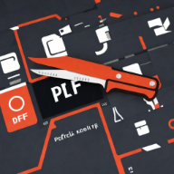

# PDF Knife

PDF Knife is a lightweight browser extension that automatically detects and downloads PDF files that are opened in your browser. No more manual right-clicking and saving PDFs - PDF Knife does it for you!

## Features

- Automatically download PDFs when they're opened in your browser
- Manual download button for PDFs embedded in custom viewers
- Works with multiple PDF viewing contexts (native browser viewer, Google Drive, custom viewers)
- Exclude specific domains from auto-downloading
- Customize download location within your Downloads folder
- Set conflict handling preferences (unique name, overwrite, prompt)
- Right-click context menu for PDF links
- Auto-rename PDFs using document title

## Installation

### Chrome Web Store (Recommended)

1. Visit the [Chrome Web Store](https://chrome.google.com/webstore) and search for "PDF Knife"
2. Click "Add to Chrome"
3. Confirm the installation

### Manual Installation (Chrome, Edge, Brave, etc.)

1. Download the latest release ZIP file from [Releases](https://github.com/The-True-Hooha/pdf-knife/releases)
2. Extract the ZIP file to a folder on your computer
3. Open your browser and navigate to `chrome://extensions/`
4. Enable "Developer mode" using the toggle in the top-right corner
5. Click "Load unpacked" and select the extracted folder
6. PDF Knife will now be installed and appear in your extensions

### Manual Installation (Firefox)

1. Download the latest `.xpi` file from [Releases](https://github.com/The-True-Hooha/pdf-knife/releases)
2. In Firefox, open the Add-ons Manager (`about:addons`)
3. Click the gear icon and select "Install Add-on From File..."
4. Navigate to and select the downloaded `.xpi` file
5. Click "Add" when prompted

## Usage

### Automatic Downloads

Once installed, PDF Knife will automatically download any PDF that opens directly in your browser. Look for a notification when a PDF is downloaded (if enabled in settings).

### Manual Downloads

For PDFs displayed in custom viewers or embedded in websites (like archive.org):

1. Click the PDF Knife icon in your toolbar
2. Click the "Download Current PDF" button

### Context Menu

Right-click on any link to a PDF file to see the "Download PDF with PDF Knife" option.

## Settings

Access settings by clicking the PDF Knife icon and then clicking "Settings":

- **Download Location**: Customize where PDFs are saved relative to your Downloads folder
- **Auto-rename files**: Use the document title as the filename
- **File conflict handling**: Choose how to handle duplicate filenames
- **Notifications**: Toggle download notifications
- **Domain exclusions**: Specify websites where PDF Knife should not auto-download

## Permissions Explained

PDF Knife requires the following permissions:

- **Storage**: To save your settings and preferences
- **Downloads**: To download PDFs
- **ActiveTab**: To access the current page for PDF detection
- **Notifications**: To show download notifications
- **Context Menus**: For the right-click download option

## Privacy

PDF Knife operates entirely within your browser. No data is sent to external servers, and no browsing activity is tracked.

## Troubleshooting

If PDFs aren't downloading automatically:

1. Make sure PDF Knife is enabled (click the toolbar icon to check)
2. Check if the website is in your exclusion list
3. Some highly customized PDF viewers may not be detected automatically - use the manual download button

## Contributing

Contributions are welcome! Please feel free to submit a Pull Request.

## License

This project is licensed under the MIT License - see the LICENSE file for details.

## Support

If you encounter any issues or have questions, please [open an issue](https://github.com/The-True-Hooha/pdf-knife/issues) or reach out <davidhero125@gmail.com>.

---

Made with ❤️ for PDF enthusiasts everywhere.
